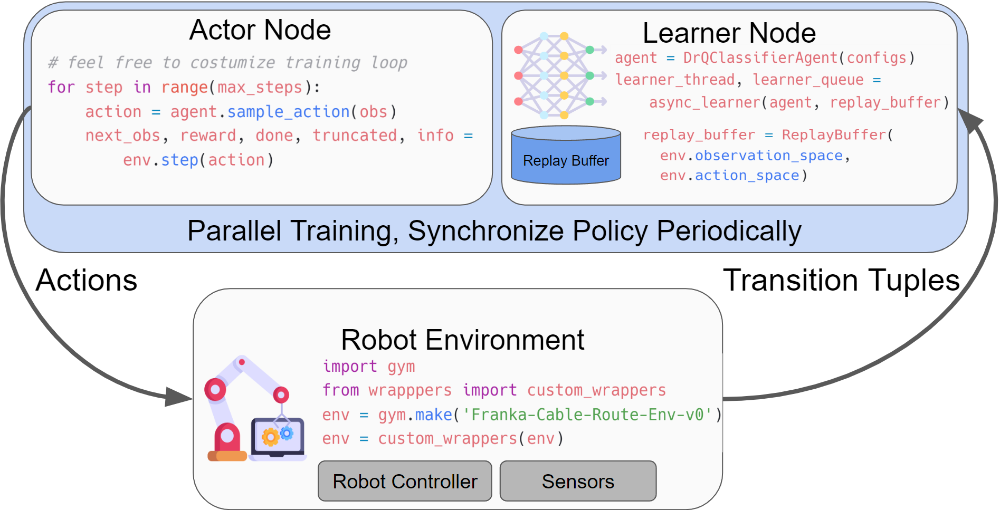

# HIL-SERL: Precise and Dexterous Robotic Manipulation via Human-in-the-Loop Reinforcement Learning

[](https://opensource.org/licenses/Apache-2.0)
[](https://hil-serl.github.io/)
[](https://discord.gg/G4xPJEhwuC)


**Webpage: [https://hil-serl.github.io/](https://hil-serl.github.io/)**

HIL-SERL provides a set of libraries, env wrappers, and examples to train RL policies using a combination of demonstrations and human corrections to perform robotic manipulation tasks with near-perfect success rates. The following sections describe how to use HIL-SERL. We will illustrate the usage with examples.

🎬: [HIL-SERL video](https://www.youtube.com/watch?v=GuD_-zhJgbs)

**Table of Contents**
- [HIL-SERL: Precise and Dexterous Robotic Manipulation via Human-in-the-Loop Reinforcement Learning](#serl-a-software-suite-for-sample-efficient-robotic-reinforcement-learning)
  - [Installation](#installation)
  - [Overview and Code Structure](#overview-and-code-structure)
  - [Run with Franka Arm](#run-with-franka-arm)
  <!-- - [Contribution](#contribution) -->
  - [Citation](#citation)

## Installation
1. **Setup Conda Environment:**
    create an environment with
    ```bash
    conda create -n hilserl python=3.10
    ```

2. **Install Jax as follows:**
    - For CPU (not recommended):
        ```bash
        pip install --upgrade "jax[cpu]"
        ```

    - For GPU:
        ```bash
        pip install --upgrade "jax[cuda12_pip]==0.4.35" -f https://storage.googleapis.com/jax-releases/jax_cuda_releases.html
        ```

    - For TPU
        ```bash
        pip install --upgrade "jax[tpu]" -f https://storage.googleapis.com/jax-releases/libtpu_releases.html
        ```
    - See the [Jax Github page](https://github.com/google/jax) for more details on installing Jax.

3. **Install the serl_launcher**
    ```bash
    cd serl_launcher
    pip install -e .
    pip install -r requirements.txt
    ```

4. **Install for serl_robot_infra** Follow the [README](./serl_robot_infra/README.md) in `serl_robot_infra` for installation and basic robot operation instructions. This contains the instruction for installing the impendence-based [serl_franka_controllers](https://github.com/rail-berkeley/serl_franka_controllers). After the installation, you should be able to run the robot server, interact with the gym `franka_env` (hardware).

## Overview and Code Structure

HIL-SERL provides a set of common libraries for users to train RL policies for robotic manipulation tasks. The main structure of running the RL experiments involves having an actor node and a learner node, both of which interact with the robot gym environment. Both nodes run asynchronously, with data being sent from the actor to the learner node via the network using [agentlace](https://github.com/youliangtan/agentlace). The learner will periodically synchronize the policy with the actor. This design provides flexibility for parallel training and inference.

<!-- <p align="center">
  
</p> -->

**Table for code structure**

| Code Directory | Description |
| --- | --- |
| [examples](https://github.com/rail-berkeley/hil-serl/blob/main/examples) | Scripts for policy training, demonstration data collection, reward classifier training |
| [serl_launcher](https://github.com/rail-berkeley/hil-serl/blob/main/serl_launcher) | Main code for HIL-SERL |
| [serl_launcher.agents](https://github.com/rail-berkeley/hil-serl/blob/main/serl_launcher/serl_launcher/agents/) | Agent Policies (e.g. SAC, BC) |
| [serl_launcher.wrappers](https://github.com/rail-berkeley/hil-serl/blob/main/serl_launcher/serl_launcher/wrappers) | Gym env wrappers |
| [serl_launcher.data](https://github.com/rail-berkeley/hil-serl/blob/main/serl_launcher/serl_launcher/data) | Replay buffer and data store |
| [serl_launcher.vision](https://github.com/rail-berkeley/hil-serl/blob/main/serl_launcher/serl_launcher/vision) | Vision related models and utils |
| [serl_robot_infra](./serl_robot_infra/) | Robot infra for running with real robots |
| [serl_robot_infra.robot_servers](https://github.com/rail-berkeley/hil-serl/blob/main/serl_robot_infra/robot_servers/) | Flask server for sending commands to robot via ROS |
| [serl_robot_infra.franka_env](https://github.com/rail-berkeley/hil-serl/blob/main/serl_robot_infra/franka_env/) | Gym env for Franka robot |

## Run with Franka Arm

We provide a step-by-step guide to run RL policies with HIL-SERL on a Franka robot.

Check out the [Run with Franka Arm](/docs/franka_walkthrough.md)
 - [RAM Insertion](/docs/franka_walkthrough.md#1-ram-insertion)
 - [USB Pickup and Insertion](/docs/real_franka.md#2-usb-pick-up-and-insertion)
 - [Object Handover](/docs/real_franka.md#3-object-handover)
 - [Egg Flip](/docs/real_franka.md#4-egg-flip)

<!-- ## Contribution

We welcome contributions to this repository! Fork and submit a PR if you have any improvements to the codebase. Before submitting a PR, please run `pre-commit run --all-files` to ensure that the codebase is formatted correctly. -->

## Citation

If you use this code for your research, please cite our paper:

```bibtex
@misc{luo2024hilserl,
      title={Precise and Dexterous Robotic Manipulation via Human-in-the-Loop Reinforcement Learning},
      author={Jianlan Luo and Charles Xu and Jeffrey Wu and Sergey Levine},
      year={2024},
      eprint={2410.21845},
      archivePrefix={arXiv},
      primaryClass={cs.RO}
}
```


## Update

一下是该项目在本地复现中的一些问题记录
1. spacemouse_test: 如果报错无法打开设备

    ```bash
    sudo chmod 666 /dev/hidraw*
    ```
2. 安装libfranka和franka ros相关问题可能用到的命令行
    ```bash
    sudo apt install ros-noetic-libfranka ros-noetic-franka-ros​ 不符合版本需求的话,从源码安装

    #查看版本​
    #通过apt-get install, dpkg等方式安装的:​
    dpkg -l | grep libfranka​
    dpkg -l | grep ros-noetic-franka-ros

    #卸载​
    sudo apt remove --auto-remove ros-noetic-libfranka​
    sudo dpkg --remove --force-depends libfranka

    #查看bin路径​
    dpkg -L ros-noetic-libfranka​
    dpkg -L ros-noetic-libfranka | grep echo_robot_state

    #查看apt install franka-ros 的 rospack 路径​
    rospack find franka_control​
    ls $(rospack find franka_control)/config​
    sudo gedit /opt/ros/noetic/share/franka_control/config/franka_control_node.yaml​
    realtime_config: enforce修改为 ignore

    #测试硬件链接 ref: https://frankaemika.github.io/docs/getting_started.html​
    ./examples/echo_robot_state <fci-ip>
    ```
3. realsense 相关
    ```bash
    a. https://github.com/IntelRealSense/librealsense/blob/master/doc/distribution_linux.md
    b. https://github.com/IntelRealSense/realsense-ros#installation-instructions
    c. https://zhuanlan.zhihu.com/p/626664186
    d. Real-sense busy: lsof | grep /dev/video
    ```

4. Cuda cudnn jax
    ```bash
    1. pip list | grep cuda
    2. python -c "import jax; print(jax.__version__, jax.default_backend())"
    3. pip uninstall -y jax jaxlib jax-cuda12-pjrt jax-cuda12-plugin
    4. pip install --upgrade jax jaxlib jax-cuda12-pjrt jax-cuda12-plugin
    ```

5. zmq.error.ZMQError: Address already in use (addr='tcp://*:5588')
    ```bash
    lsof -i :5588
    ```

6. 夹爪 "can not re-initialize"
    ```bash
    1. Robot server: ctrl+c, then ctrl + \
    2. Click re-initialize, 手动辅助,感受到阻力变大后,再次re-initialize
    ```

7. demo

    <video width="300" controls>
        <source src="./docs/videos/hilserl_franka_hw_test.mp4" type="video/mp4">
        Your browser does not support the video tag.
    </video>
