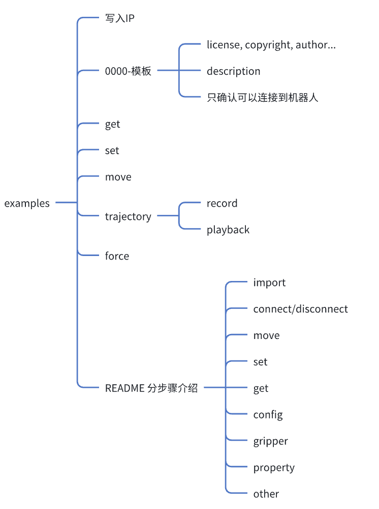

# astribot_sdk example

<!--  -->

## 1xx-example

The 1xx series of examples provide you with some basic robot function module demonstrations, including getting robot status and setting desired value to robot.

If you are sure the robot is started, then run:

```bash
python3 100-read_property.py
python3 101-get_joint_states.py
python3 102-get_cartesian_states.py
python3 103-joint_position_control.py move_joints_position
python3 103-joint_position_control.py set_joints_position
python3 105-cartesian_control.py move_cartesian
python3 106-cartesian_control.py set_cartesian
python3 106-effector_open_close.py
python3 107-get_images_dict.py
```

## 2xx-example

The 2xx series of examples provide you with some advanced robot function module demonstrations.

If you are sure the robot is started, then run:

```bash
python3 201-head_follow.py
python3 202-chassis_joy_control.py
python3 203-kinematics.py
python3 204-follow_waypoints.py joints_waypoints
python3 204-follow_waypoints.py cartesian_waypoints
python3 205-self_collosion_avoidance.py
python3 206-get_closest_dist.py
```

## 999-stop_robot

We provide a soft emergency stop button for the robot on the web, and it can also be implemented through code.
Here is an example of a soft emergency stop, which stops during motion and restarts after 3 seconds.

If you are sure the robot is started, then run:

```bash
python3 999-stop_robot.py
```
